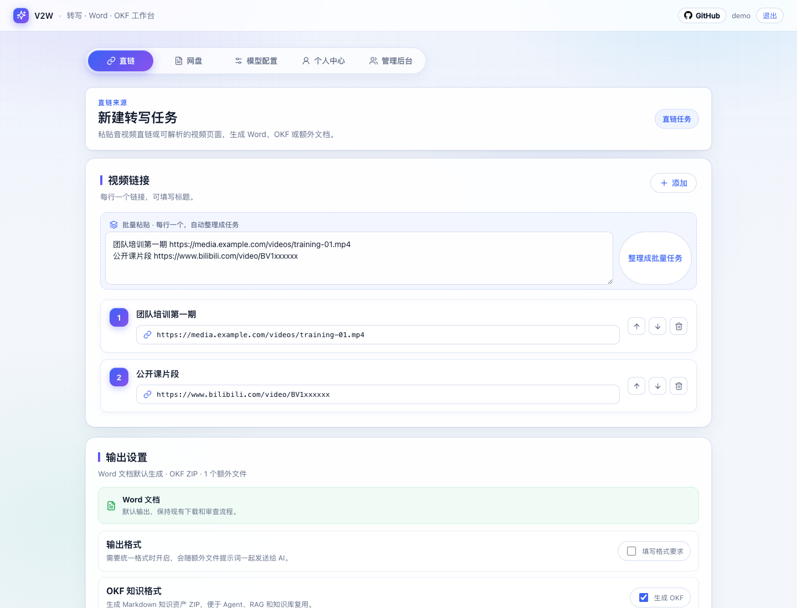
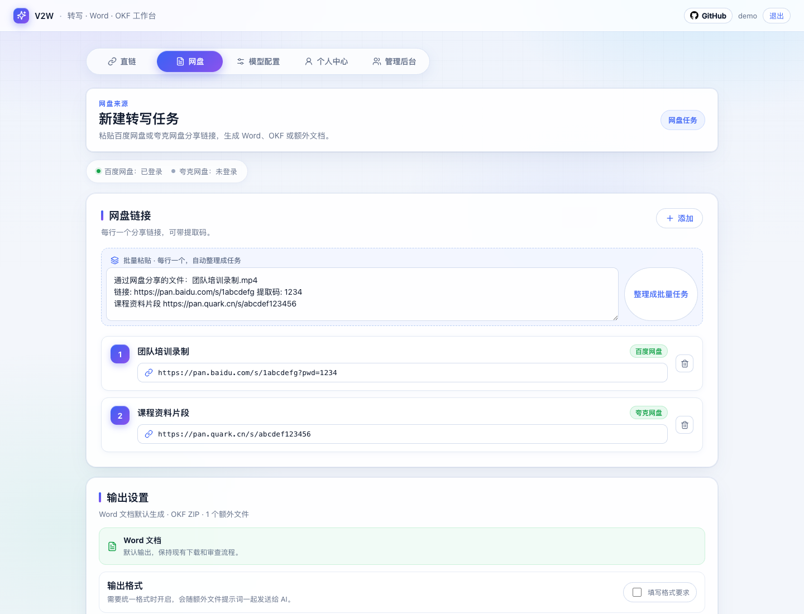
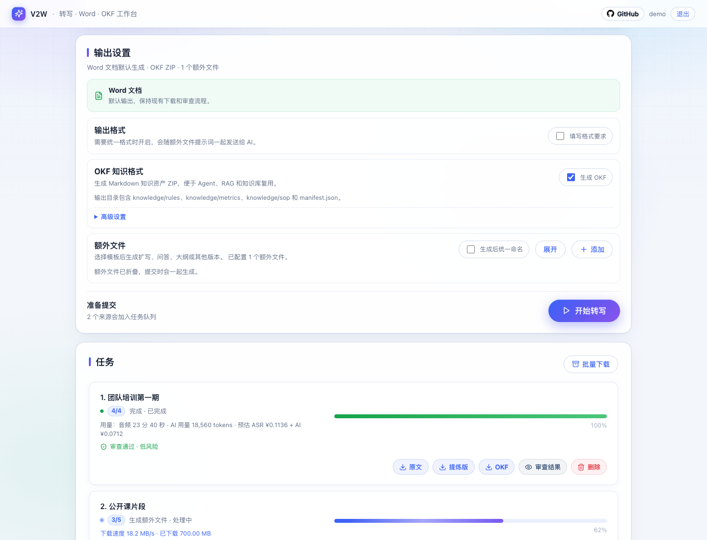
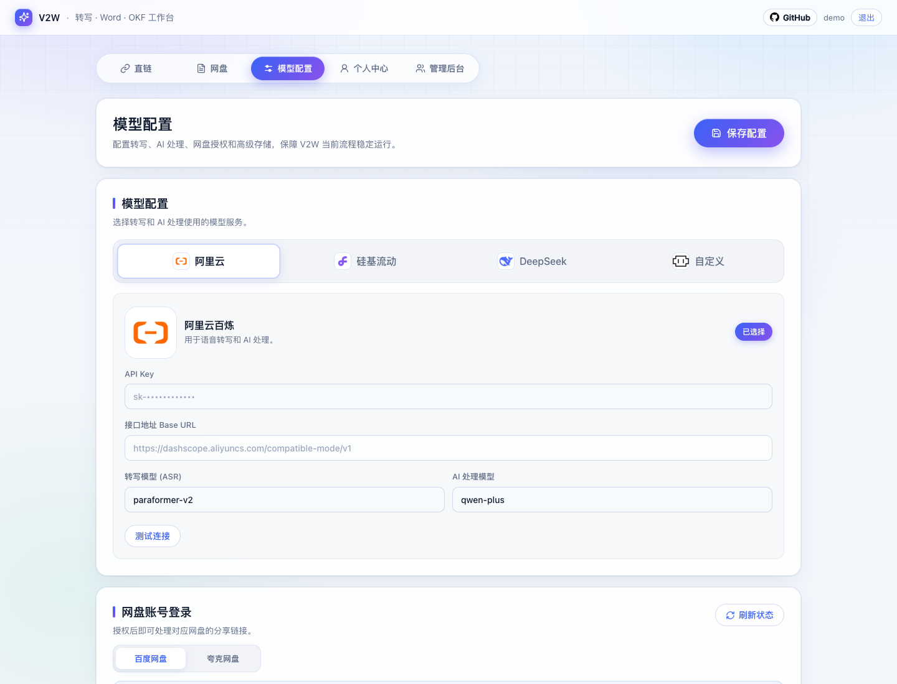
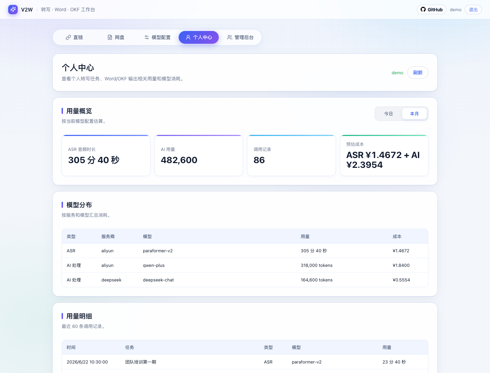
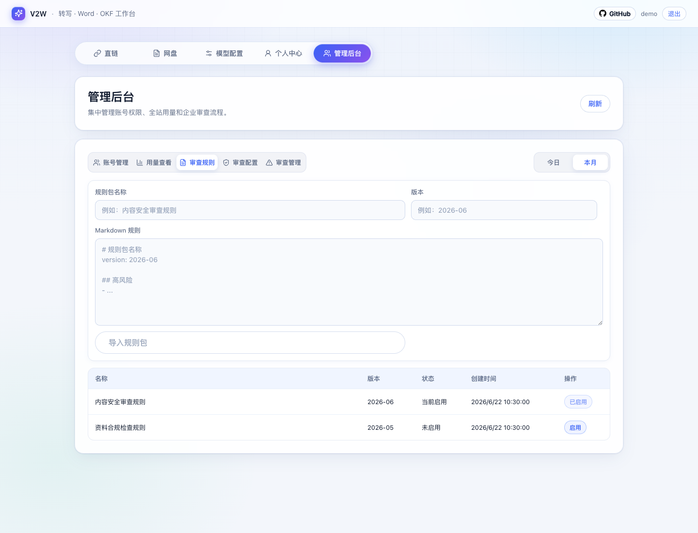

# V2W - Video to Word and OKF Export

[GitHub](https://github.com/joyrayai/v2w) · [Issues](https://github.com/joyrayai/v2w/issues)

V2W is a self-hosted workspace for turning videos, audio, and cloud-drive media into Word documents and OKF Markdown knowledge bundles. It supports batch transcription from public media URLs, video pages, Baidu Netdisk shares, and Quark Netdisk shares, then generates `.docx` outputs, reusable prompt-based documents, optional OKF ZIP exports, and optional custom HTTP output for downstream knowledge systems.

The project is designed for small teams that need stable media-to-document workflows on their own server, with account-based model settings, reusable prompt templates, usage tracking, retryable jobs, admin controls, and a native MCP endpoint for agent integrations such as OpenClaw.

V2W is an early open-source release. The core transcription and document-generation workflow is the default path. Enterprise review, OKF export, MCP integration, and netdisk automation are optional advanced capabilities that can be enabled only when your deployment needs them.

Current version: `0.4.0` Stable / 稳定版

## Screenshots

### Workspace



### More Views

| Netdisk jobs | Output and OKF options |
| --- | --- |
|  |  |

| Model configuration | Usage center |
| --- | --- |
|  |  |

| Admin review controls |
| --- |
|  |

## Core Workflow

1. Submit one or more direct media links, video page links, or supported netdisk share links.
2. Configure an ASR model and an OpenAI-compatible AI model for the current account.
3. Generate the original transcript Word file.
4. Optionally generate extra Word files from reusable prompts and per-document format requirements.
5. Download individual outputs or a batch ZIP.

## Features

- Batch submission from multiple links.
- Public HTTP/HTTPS media transcription.
- Bilibili and generic video-page parsing through `yt-dlp`.
- Baidu Netdisk share processing through `BaiduPCS-Go`.
- Baidu Netdisk QR-code login and manual credential authorization.
- Quark Netdisk share processing through user-provided cookies.
- Original transcript `.docx` output.
- Extra `.docx` files generated from reusable prompts.
- Optional OKF Markdown bundle output for knowledge assets under `knowledge/rules`, `knowledge/metrics`, and `knowledge/sop`.
- Optional custom HTTP/HTTPS output to push generated transcripts, extra documents, or OKF metadata into downstream systems.
- Per-extra-document output format instructions rendered into real Word styles.
- Built-in templates for `提炼版` and `思维导图`.
- Per-account model configuration and prompt templates.
- Retry failed jobs or only failed extra document generation.
- Batch download for generated files.
- Account login, admin user management, and usage records.
- Usage tracking for ASR duration, AI tokens, and estimated cost.
- Optional enterprise content review with administrator-managed rule packs, dedicated review model settings, high-risk download locks, and approval records.
- SQLite persistence for single-server deployments.
- Native HTTP MCP endpoint for agent workflows.

## Advanced Capabilities

These features are optional and are not required for ordinary video-to-Word usage:

- **OKF export**: generate Markdown knowledge bundles under `knowledge/rules`, `knowledge/metrics`, and `knowledge/sop`.
- **Custom HTTP output**: define per-account delivery targets, choose a payload preset or JSON template, and retry delivery without regenerating documents.
- **Enterprise review**: run post-generation document review with administrator-managed rule packs, a dedicated review model, high-risk download locks, and approval records.
- **MCP endpoint**: expose V2W workflows to compatible agents, including setup, account, job, usage, template, and netdisk tools.
- **Netdisk automation**: use Baidu Netdisk or Quark Netdisk credentials in a self-hosted deployment to process share links.

## Roadmap

V2W enters stable maintenance mode after the `0.4.0` release. Future V2W updates will focus on performance, security, and bug fixes for the current transcription, Word, OKF, custom output, MCP, netdisk, and admin workflows.

New knowledge-management capabilities will move to **V2K**, a platform-oriented successor for turning Word documents, videos, audio, and structured knowledge into OKF assets. V2K is planned to provide online knowledge storage, unified knowledge management, and basic question-answering over organized knowledge assets.

## Tech Stack

- Frontend: Vite + React
- Backend: Node.js + Express
- Database: SQLite with `better-sqlite3`
- Word generation: `docx`
- ZIP packaging: `archiver`
- Media tools: `ffmpeg`, `ffprobe`
- Video page downloader: `yt-dlp`
- Baidu Netdisk downloader: `BaiduPCS-Go`
- Default ASR provider: Alibaba Cloud Model Studio Paraformer
- Extra document generation: OpenAI-compatible Chat Completions API

## Requirements

For Docker deployment:

- Docker Engine with Compose support
- 1 GB+ memory recommended for the base Docker image; 2 GB+ if you enable Chromium for QR-code login

For manual deployment:

- Node.js 20+
- npm
- `ffmpeg` and `ffprobe`
- `yt-dlp`
- `BaiduPCS-Go` for Baidu Netdisk links
- Chrome or Chromium for Baidu QR-code login

Public direct links can work without `BaiduPCS-Go`. Netdisk links require the corresponding netdisk authorization.

## Platform and Content Responsibility

V2W does not grant access rights to third-party content. You are responsible for ensuring that you have permission to access, download, transcribe, process, and store any media submitted to the system.

Netdisk, video-page, and download integrations depend on third-party services and tools such as Baidu Netdisk, Quark Netdisk, Bilibili, `yt-dlp`, and `BaiduPCS-Go`. Their availability may change, and your use of those integrations should comply with the relevant platform terms, local law, and your organization’s data policies.

Never submit credentials, cookies, API keys, confidential recordings, or regulated personal data to a deployment you do not control.

## Quick Start

```bash
git clone https://github.com/joyrayai/v2w.git
cd v2w
npm run setup
npm run dev
```

Open the web app and create the first administrator account when prompted. After initialization, log in and configure your model provider before submitting tasks.

Default local URLs:

- Web: `http://localhost:5173`
- API: `http://localhost:5174`

If you want the setup script to try installing system tools:

```bash
npm run setup -- --install-system
```

To only check the environment:

```bash
npm run doctor
```

## Docker Deployment

Docker is the recommended deployment path for self-hosted use. The image bundles Node.js runtime dependencies plus `ffmpeg`, `ffprobe`, `yt-dlp`, and `BaiduPCS-Go`. Chromium can be installed during image build when QR-code login is required.

```bash
git clone https://github.com/joyrayai/v2w.git
cd v2w
cp .env.example .env
```

Edit `.env` before first startup:

```bash
SESSION_SECRET=replace-with-a-long-random-secret
APP_ENCRYPTION_KEY=replace-with-a-different-long-random-secret
PUBLIC_BASE_URL=http://your-server-ip:5174
HOST_PORT=5174
```

Production containers refuse to start when `SESSION_SECRET` or `APP_ENCRYPTION_KEY` is missing or still uses the example `change-me` value.

If Docker package downloads are slow or unstable, switch the build mirror in `.env`:

```bash
APT_DEBIAN_MIRROR=http://mirrors.aliyun.com/debian
APT_SECURITY_MIRROR=http://mirrors.aliyun.com/debian-security
```

The base image does not install Chromium by default to keep deployment lighter and more reliable. If Baidu QR-code login is required, set `INSTALL_CHROMIUM=true` before building. Cookie-based netdisk login, direct links, Bilibili parsing, ASR, and document generation work without Chromium.

Start the service:

```bash
docker compose up -d --build
```

Open:

```text
http://localhost:5174
```

On a remote server, open `http://your-server-ip:5174` or the domain configured in `PUBLIC_BASE_URL`.

Runtime data is split into three bind mounts:

- `./data` -> `/data`: SQLite data, app settings, users, templates, usage records, and per-account netdisk login state.
- `./outputs` -> `/outputs`: generated Word and OKF files.
- `./cache` -> `/cache`: temporary downloads and extracted audio.

Back up `./data` before upgrading or rebuilding servers. `./cache` can be deleted when no jobs are running. `./outputs` should be retained if users still need to download generated files.

Common Docker commands:

```bash
docker compose logs -f
docker compose ps
docker compose restart
docker compose down
docker compose pull
docker compose up -d --build
```

Notes:

- If you run behind a reverse proxy, set `PUBLIC_BASE_URL` to the external HTTPS URL.
- Keep `DELIVERY_ALLOW_PRIVATE_URLS=false` unless this is a trusted private deployment that intentionally pushes custom output to an internal endpoint.
- The container exposes port `5174`; use `HOST_PORT` to change the host-side port.
- The first visit initializes the administrator account when no users exist.

## Agent / OpenClaw Quick Test

After starting the API server, the MCP endpoint is available at:

```text
http://localhost:5174/mcp
```

For OpenClaw running in Docker on the same machine, register V2W with:

```bash
openclaw mcp add v2w-local \
  --transport streamable-http \
  --url http://host.docker.internal:5174/mcp
```

Then verify tool discovery:

```bash
openclaw mcp probe v2w-local --json
```

V2W should expose `8` compact MCP tools by default. Legacy tool names remain callable for compatibility, but are hidden from `tools/list` unless `MCP_LEGACY_TOOLS=true`.

## Manual Setup

```bash
npm install
cp .env.example .env
npm run dev
```

Build for production:

```bash
npm run build
npm start
```

## Configuration

Copy `.env.example` to `.env` before running the app.

```bash
cp .env.example .env
```

Common environment variables:

| Variable | Default | Description |
| --- | --- | --- |
| `PORT` | `5174` | Backend server port |
| `HOST_PORT` | `5174` | Host-side port used by `docker-compose.yml` |
| `PUBLIC_BASE_URL` | `http://localhost:5174` | Public base URL used for temporary media URLs |
| `SESSION_SECRET` | development fallback | Secret for signed login tokens. Required in production |
| `APP_ENCRYPTION_KEY` | empty | Encrypts model keys, netdisk credentials, OSS secrets, and custom output secrets at rest. Required in production |
| `SESSION_TTL_DAYS` | `7` | Login token lifetime in days |
| `LOGIN_RATE_LIMIT_MAX` | `8` | Failed login attempts allowed in each rate-limit window |
| `LOGIN_RATE_LIMIT_WINDOW_MS` | `900000` | Login rate-limit window in milliseconds |
| `MAX_CONCURRENCY` | `5` | Global running task limit |
| `MAX_USER_RUNNING` | `2` | Running task limit per user |
| `MAX_USER_QUEUED` | `50` | Queued task limit per user |
| `MIN_FREE_DISK_GB` | `6` | Stop starting new tasks when free disk is below this value |
| `DATA_DIR` | `./data` | Directory for SQLite and persistent app data |
| `OUTPUT_DIR` | `./data/outputs` | Directory for generated Word and OKF files |
| `CACHE_DIR` | `./data` | Directory containing temporary downloads and audio subdirectories |
| `CACHE_MAX_BYTES` | `5368709120` | Maximum retained failed-job cache size before oldest cache is pruned |
| `FAILED_CACHE_TTL_HOURS` | `24` | Retention window for failed-job runtime cache |
| `CHROME_PATH` | empty | Optional Chrome path for QR-code login |
| `CHROMIUM_PATH` | empty | Optional Chromium path for QR-code login |
| `REVIEW_CONTEXT_LIMIT_TOKENS` | `1000000` | Context budget for optional enterprise document review |
| `DELIVERY_TIMEOUT_MS` | `30000` | Timeout for optional custom HTTP output requests |
| `DELIVERY_ALLOW_PRIVATE_URLS` | `false` | Allow custom HTTP output to private or local network addresses. Keep disabled for public or multi-user deployments |
| `MCP_LEGACY_TOOLS` | `false` | Show legacy fine-grained MCP tool names in `tools/list` for migration debugging |
| `BAIDUPCS_GO_VERSION` | `v4.0.1` | BaiduPCS-Go release used when building the Docker image |
| `INSTALL_CHROMIUM` | `false` | Install headless Chromium in the Docker image for Baidu QR-code login |
| `APT_DEBIAN_MIRROR` | `http://deb.debian.org/debian` | Debian mirror used when building the Docker image |
| `APT_SECURITY_MIRROR` | `http://deb.debian.org/debian-security` | Debian security mirror used when building the Docker image |

Do not commit real `.env` files, API keys, cookies, SQLite databases, or generated documents.

## Production Checklist

- Replace `SESSION_SECRET` and `APP_ENCRYPTION_KEY` with long random values before first start.
- Set `PUBLIC_BASE_URL` to the external URL users actually open.
- Keep `DELIVERY_ALLOW_PRIVATE_URLS=false` unless this is a trusted private deployment.
- Back up `./data` before upgrades; it contains users, settings, tasks, templates, review rules, and usage records.
- Keep enough disk for `./cache`; failed-job cache is retained for retry and is pruned by age and size.
- Use a reverse proxy with HTTPS for internet-facing deployments.

## Model Settings

Model API keys and model names are configured in the web app after login.

The default provider preset uses Alibaba Cloud Model Studio:

- ASR model: `paraformer-v2`
- AI model: configurable OpenAI-compatible chat model

Other OpenAI-compatible providers can be used for extra document generation by setting the base URL, API key, and model name in the model configuration page.

## Output Format Requirements

Each extra document can optionally include its own output format requirement. When enabled, V2W asks the AI model to return a structured JSON document with style definitions and content blocks, then renders that structure into a `.docx` file.

This is more reliable than asking the model to “look like” a Word document in plain text, because V2W writes the resulting font, size, bold, alignment, line spacing, and first-line indentation into the Word file itself.

Example requirements:

```text
一级标题：宋体、二号、加粗、居中
二级标题：黑体、三号、不加粗
正文：仿宋、三号、不加粗
行间距：固定值 28 磅
首行缩进 2 字符，两端对齐
```

## Custom HTTP Output

V2W can optionally push generated content to a downstream HTTP endpoint after a task finishes. This is useful when you already have an internal knowledge base, automation service, or content ingestion API.

Custom output is disabled by default. Configure it in the web app under model configuration, then choose the target in the task output settings before submitting jobs.

Supported delivery options:

- Methods: `POST`, `PUT`, or `PATCH`.
- Authentication: none, Bearer token, or custom header.
- Payload presets: full transcript and documents, OKF metadata, transcript chunks, or a custom JSON template.
- Retry: if delivery fails, retry the interface output from the completed task without redownloading media or rerunning ASR.
- Safety: by default, delivery requests block localhost, private IP ranges, and local network names. Set `DELIVERY_ALLOW_PRIVATE_URLS=true` only for trusted private deployments that intentionally push to an internal service.
- Timeout: delivery requests use `DELIVERY_TIMEOUT_MS` and become retryable if the downstream endpoint is slow or unavailable.

Custom JSON templates can reference these fields:

```text
{
  "title": "{{job.title}}",
  "sourceUrl": "{{job.link}}",
  "transcript": "{{rawText}}",
  "documents": {{json documents}},
  "okf": {{json okf}},
  "metadata": {{json metadata}}
}
```

Use `{{field.path}}` for string values and `{{json field.path}}` for JSON objects or arrays. Credentials and secret headers are stored server-side and are redacted when returned to the browser.

## Enterprise Review

V2W includes an optional enterprise review workflow for teams that need post-generation compliance checks.

This capability is disabled by default and enabled per account by an administrator. Standard users who only need transcription and prompt-based Word generation do not need to configure or interact with it. When enabled, completed jobs are reviewed against the active rule pack after the transcript and extra Word files are generated.

Enterprise review includes:

- Markdown rule-pack import and versioning.
- Separate administrator-managed OpenAI-compatible review model configuration.
- Automatic review of the generated transcript and extra documents.
- Large-context handling that batches files or slices oversized files with result aggregation.
- High-risk job download locking until an administrator records an approval reason.
- Retryable review runs without regenerating the original documents.

Review text is stored separately from the job payload in SQLite, so normal job loading remains lightweight even when many generated documents are reviewed.

## Netdisk Authorization

### Baidu Netdisk

Baidu Netdisk support depends on `BaiduPCS-Go`.

You can authorize Baidu Netdisk in the web app by:

- QR-code login, if Chrome or Chromium is available on the server.
- Manual credential login, by providing cookies or BDUSS/STOKEN values.

Each app account keeps an independent netdisk authorization state.

### Quark Netdisk

Quark Netdisk support uses cookies copied from a logged-in Quark web session. Paste the cookies in the netdisk authorization card before submitting Quark share links.

## MCP Integration

V2W exposes a native MCP-compatible HTTP endpoint after deployment:

```text
POST /mcp
```

For a local development server:

```text
http://localhost:5174/mcp
```

Implemented MCP methods:

- `initialize`
- `tools/list`
- `tools/call`

Available tools:

| Tool | Description |
| --- | --- |
| `v2w.auth` | Account setup, registration and login. Actions: `setup_status`, `create_admin`, `register`, `login` |
| `v2w.status` | Read service status. With `authToken`, also returns account configuration, netdisk authorization and job state |
| `v2w.config` | Manage model configuration. Actions: `get`, `save`, `test` |
| `v2w.netdisk` | Manage Baidu or Quark authorization. Actions: `status`, `login`, `qr_start`, `qr_status`, `qr_cancel` |
| `v2w.templates` | Manage reusable extra-document templates. Actions: `list`, `get`, `create`, `update`, `delete` |
| `v2w.jobs` | Submit, inspect, retry, delete and collect downloads for jobs. Actions: `submit`, `list`, `get`, `retry`, `retry_extra`, `delete`, `downloads` |
| `v2w.usage` | Read pricing, usage summary or itemized usage. Actions: `pricing`, `summary`, `records` |
| `v2w.admin` | Admin-only account and usage reporting. Actions: `users`, `usage_summary`, `usage_records` |

Legacy MCP tool names such as `v2w.jobs.submit` and `v2w.config.get` remain callable for compatibility, but they are hidden from `tools/list` by default. Set `MCP_LEGACY_TOOLS=true` when migrating an older integration that needs the full legacy tool list.

Authentication flow:

1. Call `v2w.status` after deployment to inspect service health and setup state.
2. If `needsAdmin` is `true`, call `v2w.auth` with `action: "create_admin"`.
3. Otherwise call `v2w.auth` with `action: "login"`, or create a user with `action: "register"`.
4. Pass the returned `authToken` in later tool arguments.
5. Call `v2w.status` again with `authToken` to verify account model configuration, netdisk authorization and job state.
6. Alternatively, pass the token as `Authorization: Bearer <token>`.

Example JSON-RPC call:

```json
{
  "jsonrpc": "2.0",
  "id": 1,
  "method": "tools/call",
  "params": {
    "name": "v2w.auth",
    "arguments": {
      "action": "login",
      "username": "admin",
      "password": "your-password"
    }
  }
}
```

Baidu QR authorization returns `qrImageDataUrl` when the QR image is ready. Agents can render that data URL directly for users to scan with the Baidu Netdisk app. `qrImageUrl` is also returned for clients that can call the protected V2W HTTP API with authentication.

Task workflow over MCP:

1. Call `v2w.auth` with `action: "login"`.
2. Call `v2w.config` with `action: "get"`; if no config exists, call `action: "save"`.
3. Call `v2w.config` with `action: "test"` to verify the AI processing model before submitting work.
4. For Baidu Netdisk links, call `v2w.netdisk` with `action: "status"`; if needed, use `action: "qr_start"` and poll `action: "qr_status"`. Use `action: "qr_cancel"` if the user abandons the QR login.
5. Call `v2w.jobs` with `action: "submit"`, `links`, optional `extraPrompts`, and optional OKF fields.
6. Poll `v2w.jobs` with `action: "list"` or `action: "get"`.
7. Call `v2w.jobs` with `action: "downloads"` after completion.

`v2w.jobs` with `action: "submit"` always uses the model configuration saved on the V2W account. Agents may pass runtime-only options such as `concurrency`, `directUrlMode`, `publicBaseUrl`, `okfEnabled`, or `okfOptions`, but should not pass model secrets in job calls.

OKF bundle workflow:

- Pass `okfEnabled: true` to generate a Markdown ZIP bundle alongside Word outputs.
- Optionally pass `okfOptions` with `owner`, `version`, and `tags`.
- The generated ZIP contains `manifest.json` and Markdown files under `knowledge/rules`, `knowledge/metrics`, and `knowledge/sop`.

Template workflow:

- Call `v2w.templates` with `action: "list"` to ensure the built-in `提炼版` and `思维导图` templates exist for the account.
- Call `v2w.templates` with `action: "create"` or `action: "update"` when an agent needs to save reusable prompts for extra Word files.
- Pass selected template titles and prompts as `extraPrompts` when calling `v2w.jobs` with `action: "submit"`.

Usage and admin workflow:

- Call `v2w.usage` with `action: "summary"` after job completion to report ASR seconds, AI tokens, and estimated cost for the current account.
- Call `v2w.usage` with `action: "records"` when an agent needs itemized records for a report.
- Call `v2w.usage` with `action: "pricing"` to explain how local cost estimates are calculated.
- Admin accounts can call `v2w.admin` with `action: "users"`, `action: "usage_summary"`, or `action: "usage_records"` for organization-level reporting.
- Enterprise review is managed through the web admin API and UI. It is intentionally outside the default MCP workflow so standard users and general-purpose agents are not exposed to compliance controls unless an administrator enables them.

Manual netdisk authorization:

- Baidu: call `v2w.netdisk` with `{ "action": "login", "provider": "baidu", "mode": "cookies", "cookies": "BDUSS=...; STOKEN=..." }`, or with `{ "action": "login", "provider": "baidu", "mode": "bduss", "bduss": "...", "stoken": "..." }`.
- Quark: call `v2w.netdisk` with `{ "action": "login", "provider": "quark", "mode": "cookies", "cookies": "__pus=...; __puus=..." }`.

MCP responses redact known credential fields from command output. Clients should still avoid logging raw cookies or tokens.

## Runtime Data

Local development stores runtime files under `data/` by default:

```text
data/
├── app.sqlite
├── downloads/
├── audio/
├── outputs/
└── netdisk-users/
```

Docker deployment maps the same responsibilities to separate host directories:

```text
data/     # SQLite, users, settings, templates, usage records, netdisk login state
outputs/  # Generated Word and OKF files
cache/    # Temporary downloads and extracted audio
```

These directories are ignored by Git. Back up `data/` before upgrades. Keep `outputs/` if users still need generated files. `cache/` is disposable when no jobs are running.

## Supported Link Types

- Public direct media links, such as `.mp4`, `.mov`, `.m4a`, `.mp3`.
- Bilibili video page links.
- Other video pages supported by `yt-dlp`.
- Baidu Netdisk share links.
- Quark Netdisk share links.

Unsupported netdisk providers will be rejected with a clear error message.

## Usage Notes

- The app is built for single-server deployment.
- Running tasks are processed by the Node.js process and stored in SQLite.
- If the process restarts, queued tasks can continue, while interrupted running tasks may need retry.
- Large files require enough local disk space for temporary download and audio extraction.
- Netdisk cookies can expire and may need re-authorization.
- Estimated cost is calculated from local pricing config and may differ from the final provider bill.

## Third-Party Marks

This repository may show names or logos for supported providers and tools, including GitHub, Alibaba Cloud, DeepSeek, SiliconFlow, Baidu Netdisk, Quark Netdisk, Bilibili, and other services. Those names and marks belong to their respective owners. Their appearance only indicates interoperability or configuration presets, not endorsement or affiliation.

## Useful Commands

```bash
npm run dev       # Start frontend and backend in development mode
npm run build     # Build frontend
npm start         # Start backend in production mode
npm run setup     # Install dependencies and prepare local environment
npm run doctor    # Check environment
```

## License

GPL-3.0-only
