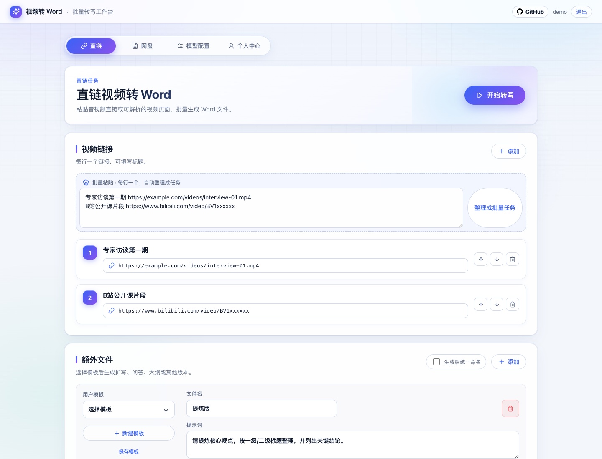

# V2W

[GitHub](https://github.com/joyrayai/v2w) · [Issues](https://github.com/joyrayai/v2w/issues)

V2W is a self-hosted video-to-Word workspace. It can batch transcribe public video links, video page links, Baidu Netdisk shares, and Quark Netdisk shares into `.docx` files. It also supports generating additional Word documents from custom prompts, such as outlines, Q&A notes, summaries, or rewritten drafts.

The project is designed for small teams that want to run the full workflow on their own server.

Current version: `0.1.4`

## Screenshot



## Features

- Batch task submission from multiple links.
- Public HTTP/HTTPS audio and video link transcription.
- Bilibili page link parsing.
- Generic video page download through `yt-dlp`.
- Baidu Netdisk share processing through `BaiduPCS-Go`.
- Baidu Netdisk QR-code login for easier account authorization.
- Quark Netdisk share processing through user-provided cookies.
- Word output for the original transcript.
- Extra Word output generated from user templates and prompts.
- Per-account prompt templates.
- Retry failed tasks or failed extra document generation.
- Batch download of generated Word files.
- Account registration and login.
- Admin page for account management and usage records.
- Usage tracking for ASR duration, AI tokens, and estimated cost.
- SQLite-based single-machine persistence.
- Native MCP HTTP endpoint for agent integration.

## Tech Stack

- Frontend: Vite + React
- Backend: Node.js + Express
- Database: SQLite with `better-sqlite3`
- Word generation: `docx`
- ZIP packaging: `archiver`
- Media tools: `ffmpeg`, `ffprobe`
- Video page downloader: `yt-dlp`
- Baidu Netdisk downloader: `BaiduPCS-Go`
- Default ASR provider: Alibaba Cloud Model Studio Paraformer
- Extra document generation: OpenAI-compatible Chat Completions API

## Requirements

- Node.js 20+
- npm
- `ffmpeg` and `ffprobe`
- `yt-dlp`
- `BaiduPCS-Go` for Baidu Netdisk links
- Chrome or Chromium for Baidu QR-code login

Public direct links can work without `BaiduPCS-Go`. Netdisk links require the corresponding netdisk authorization.

## Quick Start

```bash
git clone https://github.com/joyrayai/v2w.git
cd v2w
npm run setup
npm run dev
```

Open the web app and create the first administrator account when prompted. After initialization, log in and configure your model provider before submitting tasks.

Default local URLs:

- Web: `http://localhost:5173`
- API: `http://localhost:5174`

If you want the setup script to try installing system tools:

```bash
npm run setup -- --install-system
```

To only check the environment:

```bash
npm run doctor
```

## Manual Setup

```bash
npm install
cp .env.example .env
npm run dev
```

Build for production:

```bash
npm run build
npm start
```

## Configuration

Copy `.env.example` to `.env` before running the app.

```bash
cp .env.example .env
```

Common environment variables:

| Variable | Default | Description |
| --- | --- | --- |
| `PORT` | `5174` | Backend server port |
| `PUBLIC_BASE_URL` | `http://localhost:5174` | Public base URL used for temporary media URLs |
| `SESSION_SECRET` | development fallback | Secret for signed login tokens |
| `MAX_CONCURRENCY` | `5` | Global running task limit |
| `MAX_USER_RUNNING` | `2` | Running task limit per user |
| `MAX_USER_QUEUED` | `50` | Queued task limit per user |
| `MIN_FREE_DISK_GB` | `6` | Stop starting new tasks when free disk is below this value |
| `CHROME_PATH` | empty | Optional Chrome path for QR-code login |
| `CHROMIUM_PATH` | empty | Optional Chromium path for QR-code login |

Do not commit real `.env` files, API keys, cookies, SQLite databases, or generated documents.

## Model Settings

Model API keys and model names are configured in the web app after login.

The default provider preset uses Alibaba Cloud Model Studio:

- ASR model: `paraformer-v2`
- AI model: configurable OpenAI-compatible chat model

Other OpenAI-compatible providers can be used for extra document generation by setting the base URL, API key, and model name in the model configuration page.

## Netdisk Authorization

### Baidu Netdisk

Baidu Netdisk support depends on `BaiduPCS-Go`.

You can authorize Baidu Netdisk in the web app by:

- QR-code login, if Chrome or Chromium is available on the server.
- Manual credential login, by providing cookies or BDUSS/STOKEN values.

Each app account keeps an independent netdisk authorization state.

### Quark Netdisk

Quark Netdisk support uses cookies copied from a logged-in Quark web session. Paste the cookies in the netdisk authorization card before submitting Quark share links.

## MCP Integration

V2W exposes a native MCP-compatible HTTP endpoint after deployment:

```text
POST /mcp
```

For a local development server:

```text
http://localhost:5174/mcp
```

Implemented MCP methods:

- `initialize`
- `tools/list`
- `tools/call`

Available tools:

| Tool | Description |
| --- | --- |
| `v2w.service_info` | Read service status, runtime limits and queue status |
| `v2w.login` | Log in with a V2W account and return an `authToken` |
| `v2w.config.get` | Read the current account model configuration with secrets redacted |
| `v2w.config.save` | Save model and optional OSS configuration for the account |
| `v2w.netdisk.status` | Read Baidu or Quark authorization status |
| `v2w.baidu_qr.start` | Start Baidu Netdisk QR authorization |
| `v2w.baidu_qr.status` | Poll Baidu Netdisk QR authorization status |
| `v2w.templates.list` | List extra document templates, including default templates |
| `v2w.jobs.submit` | Submit direct, page, Baidu Netdisk or Quark Netdisk links as jobs |
| `v2w.jobs.list` | List jobs for the current account |
| `v2w.jobs.get` | Read one job and its current progress |
| `v2w.jobs.retry` | Retry a failed job, or retry only failed extra documents when possible |
| `v2w.jobs.retry_extra` | Retry only failed extra documents from cached transcript text |
| `v2w.jobs.delete` | Delete a non-running job and its files |
| `v2w.jobs.downloads` | Return generated document download URLs and a batch ZIP URL |

Authentication flow:

1. Call `v2w.login` with `username` and `password`.
2. Pass the returned `authToken` in later tool arguments.
3. Alternatively, pass the token as `Authorization: Bearer <token>`.

Example JSON-RPC call:

```json
{
  "jsonrpc": "2.0",
  "id": 1,
  "method": "tools/call",
  "params": {
    "name": "v2w.login",
    "arguments": {
      "username": "admin",
      "password": "your-password"
    }
  }
}
```

Baidu QR authorization returns `qrImageDataUrl` when the QR image is ready. Agents can render that data URL directly for users to scan with the Baidu Netdisk app. `qrImageUrl` is also returned for clients that can call the protected V2W HTTP API with authentication.

Task workflow over MCP:

1. Call `v2w.login`.
2. Call `v2w.config.get`; if no config exists, call `v2w.config.save`.
3. For Baidu Netdisk links, call `v2w.netdisk.status`; if needed, use `v2w.baidu_qr.start` and poll `v2w.baidu_qr.status`.
4. Call `v2w.jobs.submit` with `links` and optional `extraPrompts`.
5. Poll `v2w.jobs.list` or `v2w.jobs.get`.
6. Call `v2w.jobs.downloads` after completion.

`v2w.jobs.submit` always uses the model configuration saved on the V2W account. Agents may pass runtime-only options such as `concurrency`, `directUrlMode`, or `publicBaseUrl`, but should not pass model secrets in job calls.

## Runtime Data

Runtime files are stored under `data/`:

```text
data/
├── app.sqlite
├── downloads/
├── audio/
├── outputs/
└── netdisk-users/
```

`data/` is ignored by Git. Back it up separately if you need to preserve users, tasks, templates, usage records, or generated documents.

## Supported Link Types

- Public direct media links, such as `.mp4`, `.mov`, `.m4a`, `.mp3`.
- Bilibili video page links.
- Other video pages supported by `yt-dlp`.
- Baidu Netdisk share links.
- Quark Netdisk share links.

Unsupported netdisk providers will be rejected with a clear error message.

## Usage Notes

- The app is built for single-server deployment.
- Running tasks are processed by the Node.js process and stored in SQLite.
- If the process restarts, queued tasks can continue, while interrupted running tasks may need retry.
- Large files require enough local disk space for temporary download and audio extraction.
- Netdisk cookies can expire and may need re-authorization.
- Estimated cost is calculated from local pricing config and may differ from the final provider bill.

## Useful Commands

```bash
npm run dev       # Start frontend and backend in development mode
npm run build     # Build frontend
npm start         # Start backend in production mode
npm run setup     # Install dependencies and prepare local environment
npm run doctor    # Check environment
```

## License

MIT
